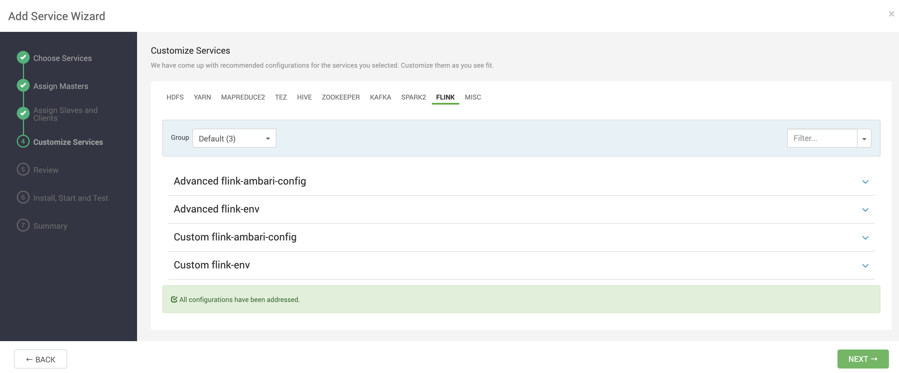
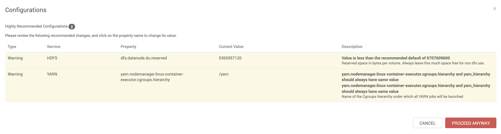

# Install Apache Flink

## Prerequisites

- Having provisioned one of the Vagrant 3 nodes cluster or Vagrant single node cluster [instructions here](../02-Provision_the_environment/README.md) 
- Having connected to node1 
- YARM, MapReduce2, HDFS and Zookeeper must be running __BEFORE__ to install Flink

```
$ vagrant ssh node1
```

## Flink installation

After having logged in into Ambari using the web UI, follow the visual instructions listed below:

Click on Add Service


Select **Flink** and click Next


Select one node to host Apache Flink then click Next


Accept all the defaults and click Next


Aknowledge the warnings and click Proceed anyway


Click Deploy


Remember to restart all the services if needed

In the case of trouble, Flink installation/runtime logs are available at

```console
[vagrant@node1 ~]$ tail -500f /var/log/flink/flink-setup.log
...
```

## Testing Flink installation

Create the input dir:

```console
[vagrant@node1 ~]$ sudo su - flink
[flink@node1 ~]$ hadoop fs -mkdir lab20_input
```

Copy the input dataset:

```console
[flink@node1 ~]$ hadoop fs -put /usr/src/git_repo/datasets/constitution.txt lab20_input/constitution.txt
```

```console
[flink@node1 ~]$ cd /opt/flink
[flink@node1 flink]$ export HADOOP_CLASSPATH=`hadoop classpath`
[flink@node1 flink]$ export HADOOP_CONF_DIR=/etc/hadoop/conf
[flink@node1 flink]$ ./bin/flink run \
    examples/streaming/WordCount.jar  \
    --input hdfs://node1.example.com:8020/user/vagrant/lab20_input/constitution.txt \
    --output hdfs:/user/flink/lab20_output.txt
SLF4J: Class path contains multiple SLF4J bindings.
SLF4J: Found binding in [jar:file:/opt/flink/lib/slf4j-log4j12-1.7.15.jar!/org/slf4j/impl/StaticLoggerBinder.class]
SLF4J: Found binding in [jar:file:/usr/hdp/3.1.4.0-315/hadoop/lib/slf4j-log4j12-1.7.25.jar!/org/slf4j/impl/StaticLoggerBinder.class]
SLF4J: See http://www.slf4j.org/codes.html#multiple_bindings for an explanation.
SLF4J: Actual binding is of type [org.slf4j.impl.Log4jLoggerFactory]
2021-10-02 13:01:24,493 INFO  org.apache.flink.yarn.cli.FlinkYarnSessionCli                 - Found Yarn properties file under /tmp/.yarn-properties-flink.
2021-10-02 13:01:24,493 INFO  org.apache.flink.yarn.cli.FlinkYarnSessionCli                 - Found Yarn properties file under /tmp/.yarn-properties-flink.
2021-10-02 13:01:24,877 INFO  org.apache.flink.yarn.cli.FlinkYarnSessionCli                 - YARN properties set default parallelism to 1
2021-10-02 13:01:24,877 INFO  org.apache.flink.yarn.cli.FlinkYarnSessionCli                 - YARN properties set default parallelism to 1
YARN properties set default parallelism to 1
2021-10-02 13:01:25,159 INFO  org.apache.hadoop.yarn.client.RMProxy                         - Connecting to ResourceManager at node1.example.com/192.168.199.2:8050
2021-10-02 13:01:25,459 INFO  org.apache.hadoop.yarn.client.AHSProxy                        - Connecting to Application History server at node2.example.com/192.168.199.3:10200
2021-10-02 13:01:25,470 INFO  org.apache.flink.yarn.cli.FlinkYarnSessionCli                 - No path for the flink jar passed. Using the location of class org.apache.flink.yarn.YarnClusterDescriptor to locate the jar
2021-10-02 13:01:25,470 INFO  org.apache.flink.yarn.cli.FlinkYarnSessionCli                 - No path for the flink jar passed. Using the location of class org.apache.flink.yarn.YarnClusterDescriptor to locate the jar
2021-10-02 13:01:25,612 INFO  org.apache.flink.yarn.AbstractYarnClusterDescriptor           - Found application JobManager host name 'node2.example.com' and port '32973' from supplied application id 'application_1633173902900_0004'
Starting execution of program
...
```

Inspect the output

```console
[flink@node1 flink]$
[flink@node1 flink]$ hadoop fs -cat lab20_output.txt
...
(law,39)
(varying,1)
(the,724)
(compensation,5)
(for,84)
(the,725)
(services,5)
(of,493)
(the,726)
(senators,13)
(and,264)
(representatives,28)
(shall,305)
(take,6)
(effect,4)
(until,8)
(an,18)
(election,9)
(of,494)
(representatives,29)
(shall,306)
(have,63)
(intervened,1)
...
```

To watch YARN logs (substitute **\<application ID\>** with Flink application id): 

```console
[vagrant@node1 ~]$ yarn logs -applicationId <application ID>
```

You might access the Flink Web Interface at http://localhost:8081 (or substitute **localhost** with the hostname where Flink has been started)

YARN Web Interface is accessible at http://localhost:8088/ (or substitute **localhost** with the hostname where YARN Web Interface  has been started)

In the case you need to kill Flink over YARN  (substitute **\<application ID\>** with Flink application id):

```console
[vagrant@node1 ~]$ yarn application -kill <application ID>
```