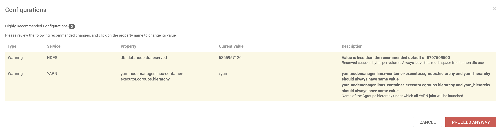

# Stream processing with Apache Flink

## Prerequisites

- Having provisioned one of the Vagrant 3 nodes cluster or Vagrant single node cluster [instructions here](../02-Provision_the_environment/README.md) 
- Having connected to node1 
- YARM, MapReduce2, HDFS and Zookeeper must be running __BEFORE__ to install Flink

```
$ vagrant ssh node1
```

## Flink installation

After having logged in into Ambari using the web UI, follow the visual instructions listed below:

Click on Add Service


Select **Flink** and click Next


Select one node to host Apache Flink then click Next


Accept all the defaults and click Next


Aknowledge the warnings and click Proceed anyway


Click Deploy


Remember to restart all the services if needed

## Testing Flink installation

```console
[vagrant@node1 ~]$ sudo su - flink
[flink@node1 ~]$ cd /opt/flink
[flink@node1 ~]$ export HADOOP_CLASSPATH=`hadoop classpath`
[flink@node1 ~]$ export HADOOP_CONF_DIR=/etc/hadoop/conf
[flink@node1 ~]$ ./bin/flink run ./examples/streaming/TopSpeedWindowing.jar
```

You might access the Flink Web Interface at http://localhost:8081 (or substitute **localhost** with the hostname where Flink has been started)